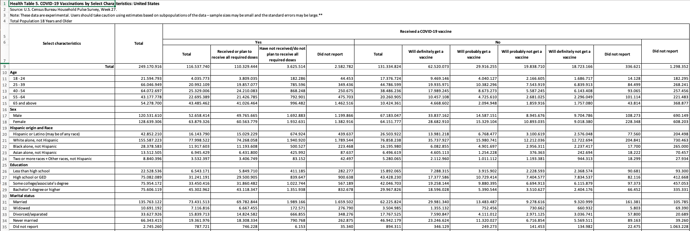
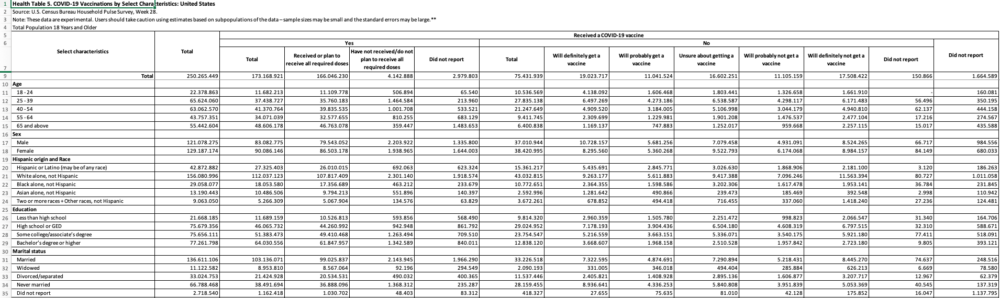

```{r, setup, include = FALSE, message=FALSE}
knitr::opts_knit$set(root.dir = '/Users/munchausend/GoogleDrive/MSc/Dissertation')
knitr::opts_knit$set(echo = FALSE, message = FALSE, include = FALSE, results = FALSE)
rm(list = ls())
library(readxl)
library(tidyverse)
library(data.table)
library(glue)
```


* Experimental survey designed to quickly and efficiently deploy data collected on how people’s lives have been impacted by the coronavirus pandemic.
* Two-week data collection period in phases 3 and 3.1 which are the ones we're interested in (with a ~2 week data release lag). **Still called weeks, e.g. W18 for 28.10 - 09.11.20, in line with previous phases**
* Data collection for the current phase (3.1) began on **April 14, 2021**, with a first data release on **May 5, 2021** (next release ~ **May 19th, 2021**). 
* Online questionnaires: **n** varies, e.g. 59,000 for the 14.04 - 28.04 period of Phase 3.1; between ~58,000 and ~78,000 in Phase 3. 
* Data collection for previous phase (*3*) began on October 28, 2020 and ended March 29, 2021.
* The questions we are interested in should be identical (or sufficiently similar) in the two phases.
* Data and more info [here](https://www.census.gov/programs-surveys/household-pulse-survey/data.html#phase3.1) and [here](https://www2.census.gov/programs-surveys/demo/technical-documentation/hhp/Phase3-1_Source_and_Accuracy_Week_28.pdf).
* Contains questions on **employment + vaccination**.


## Periods

| Dates covered    | HPS Week | Period | Phase | Topic |
| ---------------- |:--------:| :-----:| :----:| :----:|
| 28.10 - 09.11.20 |    W18   |   P1   |   3   |   E   |
| 11.11 - 23.11.20 |    W19   |   P2   |   3   |   E   |
| 25.11 - 07.12.20 |    W20   |   P3   |   3   |   E   |
| 09.12 - 21.12.20 |    W21   |   P4   |   3   |   E   |
| 06.01 - 18.01.21 |    W22   |   P5   |   3   |  E, V |
| 20.01 - 01.02.21 |    W23   |   P6   |   3   |  E, V |
| 03.02 - 15.02.21 |    W24   |   P7   |   3   |  E, V |
| 17.02 - 01.03.21 |    W25   |   P8   |   3   |  E, V |
| 03.03 - 15.03.21 |    W26   |   P9   |   3   |  E, V |
| 17.03 - 29.03.21 |    W27   |   P10  |   3   |  E, V |
| 14.04 - 26.04.21 |    W28   |   P11  |   3.1 |  E, V |
| 18.04 - 10.05.21 |    W29   |   P11  |   3.1 |  E, V |

* E: Employment
* V: Vaccination
* W: Two-week period

# Getting data tables (aggregate).

For employment we need tables 1 and 2 under *Employment Tables*. (e.g. https://www.census.gov/data/tables/2020/demo/hhp/hhp18.html)

For vaccination (starting 06.01.21) we need table 5 under *Health Tables* (e.g. https://www.census.gov/data/tables/2021/demo/hhp/hhp22.html)

```{r, getFiles, echo = FALSE, include=FALSE}
data_path <- '/Users/munchausend/GoogleDrive/MSc/Dissertation/Methods/Data/HPS/Raw'

first_week <- 18
last_week <- 28

hps_weeks <- seq(from = first_week, to = last_week, by = 1)
# hps_periods <- seq(from = 1, to = (last_week - first_week)+1, by = 1)

url_emp1 <- vector(mode = "list", length = length(hps_weeks))
dest_emp1 <- vector(mode = "list", length = length(hps_weeks))
vars_emp1 <- vector(mode = "list", length = length(hps_weeks))

url_emp2 <- vector(mode = "list", length = length(hps_weeks))
dest_emp2 <- vector(mode = "list", length = length(hps_weeks))
vars_emp2 <- vector(mode = "list", length = length(hps_weeks))

url_vacc <- vector(mode = "list", length = length(hps_weeks) - 4)
dest_vacc <- vector(mode = "list", length = length(hps_weeks) - 4)
vars_vacc <- vector(mode = "list", length = length(hps_weeks) - 4)


idx <- 1
idx_vac <- 1

for (week in hps_weeks){
  
  if (week <= 21){
    year <- "2020"
  } else {
    year <- "2021"
  }
  
  url_emp1[idx] <- glue("https://www2.census.gov/programs-surveys/demo/tables/hhp/{year}/wk{week}/employ1_week{week}.xlsx")
  
  url_emp2[idx] <- glue("https://www2.census.gov/programs-surveys/demo/tables/hhp/{year}/wk{week}/employ2_week{week}.xlsx")
  
  dest_emp1[idx] <- glue("{data_path}P{idx}_emp1.xlsx")
  vars_emp1[idx] <- glue("P{idx}_emp1")
  
  dest_emp2[idx] <- glue("{data_path}P{idx}_emp2.xlsx")
  vars_emp2[idx] <- glue("P{idx}_emp2")
  
  if (week > 21){
    url_vacc[idx_vac] <- glue("https://www2.census.gov/programs-surveys/demo/tables/hhp/{year}/wk{week}/health5_week{week}.xlsx")
    dest_vacc[idx_vac] <- glue("{data_path}P{idx}_vacc.xlsx")
    vars_vacc[idx_vac] <- glue("P{idx}_vacc")
    idx_vac <- idx_vac + 1
  }
  
  idx <- idx + 1
}

getFiles <- function(urls, dest_files, var_names){
  
  for (idx in 1:length(dest_files)){
    if (!file.exists(dest_files[[idx]])){
      curl::curl_download(urls[[idx]], dest_files[[idx]])
    }

    df <- read_excel(dest_files[[idx]],
                    sheet = 1,
                    skip = 5)

    assign(var_names[[idx]], df, envir = parent.frame())
  }}


getFiles(url_vacc, dest_vacc, vars_vacc)
getFiles(url_emp1, dest_emp1, vars_emp1)
getFiles(url_emp2, dest_emp2, vars_emp2)

```

# Cleaning tables

Tips here: https://www.sophieheloisebennett.com/posts/excel-sheet-cleaning/


## Employment

### Employment1

Employment Status and Sector of Employment, by Select Characteristics: United States


**Phase 3:** "Have you, or has anyone in your household experienced a loss of employment income since March 13, 2020? "


**Phase 3.1 (current):** "Have you, or has anyone in your household experienced a loss of employment income in the last 4 weeks?"


As the first 5 rows have been skipped, the resulting df looks like this:
```{r}
head(P1_emp1)
```


```{r cleanEmp, echo = FALSE}

cleanEmp1 <- function(df){
  
  # Remove all rows that are completely empty:
  df <- df %>% 
    filter_all(any_vars(complete.cases(.)))
  
  # Change column names and select only the ones we're interested in (i.e. total/yes/no)
  df <- df %>% 
    rename(demog = "...1",
           income_loss_total = "...2",
           income_loss_yes = "Yes...3",
           income_loss_no = "No...4",
           income_loss_nr = "Did not report...5") %>% 
    select(demog, income_loss_total, income_loss_yes, income_loss_no)
  
  # Select only the rows we're interested in (i.e. the first 10) and remove "Age" and "Sex" columns.
  # These will include total counts, as well as counts based on age and sex.
  df <- df %>% 
    slice(1:10) %>% 
    filter(demog != "Age" & demog != "Sex")
  
  # Calculate the ratio we're interested in based on total counts, as well as for each age group and sex in part
  # Ratio: Proportion of individuals that experienced loss of income out of all respondents (that reported on this measure)
  df <- df %>% 
    mutate(income_loss = income_loss_yes/(income_loss_yes + income_loss_no)) %>% 
    select(demog, income_loss)
  
  # Convert to wide (this makes more sense for combining all the periods)
  df_wide <- spread(df, demog, income_loss)
  
  return (df_wide)
}

allPeriods <- function(var_names, table){
  
  
  for (i in 1:length(var_names)){
    
    # Clean df corresponding to each period.
    
    if (table == "emp1"){
      df_i = cleanEmp1(get(var_names[[i]]))
    }
    
    if (table == "emp2"){
      df_i = cleanEmp2(get(var_names[[i]]))
    }
    
    if (table == "vacc"){
      if (i > 6){
        df_i = cleanVcc(get(var_names[[i]]), phase = "3.0")
      } else {
        df_i = cleanVcc(get(var_names[[i]]), phase = "3.1")
      }
      
    }
    
    
    # Get period from name.
    p <- sub("\\_.*", "", var_names[[i]])
    
    # Add a column corresponding to the period
    df_i <- df_i %>% 
      add_column(Period = p, .before = 1)
    
    # Initialize df for storing all periods on the first iteration, bind rows on subsequent iterations.
    if (i == 1){
      df_all_periods <- df_i
    } else {
      df_all_periods <- bind_rows(df_all_periods, df_i)
    }
    
  }
  
  return(df_all_periods)
  
}

emp1 <- allPeriods(vars_emp1, "emp1")
emp1
```


### Employment2

**Questions**:

* Phase 3.0 & 3.1: "In the last 7 days, did you do ANY work for either pay or profit? Select only one answer." [YES | NO]


```{r}
cleanEmp2 <- function(df){
  
  # Remove all rows that are completely empty:
  df <- df %>% 
    filter_all(any_vars(complete.cases(.)))
  
  
  df <- df %>%
    slice(2:11) %>% # Select only rows we're interested in (i.e. 2 - 11)
    filter(...1 != "Age" & ...1 != "Sex") %>% # and remove "Age" and "Sex" columns.
    mutate(across(contains("Yes"),as.double)) %>% # change column type from 'char' to 'double'
    mutate(Yes = rowSums(select(., contains("Yes")))) %>% # sum up all the "Yes" columns (we don't care about sector)
    # Change var names
    mutate(demog = ...1, 
           emp_loss_total = ...2,
           emp_loss_yes = Yes,
           emp_loss_no = No) %>%
    mutate(emp = emp_loss_yes/(emp_loss_yes + emp_loss_no)) %>% # Calculate ratio
    select(demog, emp)
  
  # # Convert to wide (this makes more sense for combining all the periods)
  df_wide <- spread(df, demog, emp)
  
  return (df_wide)
}

emp2 <- allPeriods(vars_emp2, "emp2")
emp2
```

### Vaccination

**Questions**:

* Phase 3.0:
  * "Have you received a COVID-19 vaccine?"
    * YES: "Did you receive (or do you plan to receive) all required doses?" 
    * NO: "Once a  vaccine to prevent COVID-19 is available to you, would you…" [Definitely get | Probably get | Probably NOT | Definitely NOT]
    
* Phase 3.1:
  * "Have you received a COVID-19 vaccine?"
    * YES: "Did you receive (or do you plan to receive) all required doses?" 
    * NO: "Once a  vaccine to prevent COVID-19 is available to you, would you…" [Definitely get | Probably get | Unsure about getting the vaccine | Probably NOT | Definitely NOT]    







#### Transformations.

```{r}
head(P10_vacc)
```

**Phase 3.0:** 

...1: demog : Demographics 
...2: total : Total (respondends Yes/No/DNR)
Yes...3: yes_total : Total *YES* responses
Yes...4: yes_all : Received or plan to receive all required doses 
Yes...5: yes_some : Have not received/do not plan to receive all required doses
Yes...6: yes_nr : Did not report (*YES* but did not report whether they will get all doses)
No...7: no_total : Total *NO* responses
No...8: no_def_will : Will definitely get a vaccine (But have not received any doses yet)
No...9: no_prob_will: Will probably get a vaccine (~)
No...10: no_prob_not : Will probably not get a vaccine
No...11: no_def_not : Will definitely not get a vaccine
No...12: no_nr : Did not report (*NO* but did not report whether they will or not)
Did not report: total_nr : Did not report *YES* or *NO*

$$vac_{att} = \frac {1* \sum yes\_all + no\_def\_will + no\_prob\_will} {}$$


```{r}
head(P11_vacc)
```

**Phase 3.1**:

...1: demog : Demographics 
...2: total : Total (respondends Yes/No/DNR)
Yes...3: yes_total : Total *YES* responses
Yes...4: yes_all : Received or plan to receive all required doses 
Yes...5: yes_some : Have not received/do not plan to receive all required doses
Yes...6: yes_nr : Did not report (*YES* but did not report whether they will get all doses)
No...7: no_total : Total *NO* responses
No...8: no_def_will : Will definitely get a vaccine (But have not received any doses yet)
No...9: no_prob_will: Will probably get a vaccine (~)
No...10: no_unsure : Unsure about getting a vaccine/
No...11: no_prob_not : Will probably not get a vaccine
No...12: no_def_not : Will definitely not get a vaccine
No...13: no_nr : Did not report (*NO* but did not report whether they will or not)
Did not report: total_nr : Did not report *YES* or *NO*


```{r cleanVacc, echo = FALSE}
cleanVacc <- function(df, phase){
    
    df <- df %>% 
      filter_all(any_vars(complete.cases(.))) 
    
    df <- df %>% 
      slice(3:11) %>% 
      filter(...1 != "Age" & ...1 != "Sex")
    
    if (phase == "3.0"){
      df <- df %>% 
        rename(demog = ...1,
               r_total = ...2,
               yes_total = Yes...3,
               yes_all = Yes...4,
               yes_some = Yes...5,
               yes_nr = Yes...6,
               no_total = No...7,
               no_def_will = No...8,
               no_prob_will = No...9,
               no_prob_not = No...10,
               no_def_not = No...11,
               no_nr = No...12,
               total_nr = `Did not report`
               )
      
    }
    
    if (phase == "3.1"){
      
      df <- df %>% 
        rename(demog = ...1,
               r_total = ...2,
               yes_total = Yes...3,
               yes_all = Yes...4,
               yes_some = Yes...5,
               yes_nr = Yes...6,
               no_total = No...7,
               no_def_will = No...8,
               no_prob_will = No...9,
               no_unsure = No...10,
               no_prob_not = No...11,
               no_def_not = No...12,
               no_nr = No...13,
               total_nr = `Did not report`
               )
    }  
    
    
    df <- df %>% 
      mutate(across(r_total:total_nr, as.double))

  return (df)
}
```

```{r}
testFunc <- cleanVacc(P11_vacc, "3.1")
testFunc
```


...1: demog : Demographics 
...2: total : Total (respondends Yes/No/DNR)
Yes...3: yes_total : Total *YES* responses
Yes...4: yes_all : Received or plan to receive all required doses 
Yes...5: yes_some : Have not received/do not plan to receive all required doses
Yes...6: yes_nr : Did not report (*YES* but did not report whether they will get all doses)
No...7: no_total : Total *NO* responses
No...8: no_def_will : Will definitely get a vaccine (But have not received any doses yet)
No...9: no_prob_will: Will probably get a vaccine (~)
No...10: no_unsure : Unsure about getting a vaccine/
No...11: no_prob_not : Will probably not get a vaccine
No...12: no_def_not : Will definitely not get a vaccine
No...13: no_nr : Did not report (*NO* but did not report whether they will or not)
Did not report: total_nr : Did not report *YES* or *NO*


### Notes:

Each table has a standard error table associated with it. The details of how these were derived can be found in the *Technical documentation* available for each week in part, e.g. [Week 28](https://www2.census.gov/programs-surveys/demo/technical-documentation/hhp/Phase3-1_Source_and_Accuracy_Week_28.pdf).

The structure should be identical in most cases, so the same functions could be used to get these. Unsure at this point how we'd be using these so will not get them just yet.


